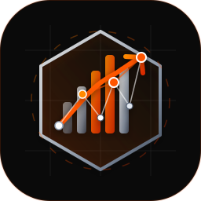

<div align="center">



# FinAgent

**🔐 Privacy-first personal finance automation, local by default.**

[](https://github.com/malfihasan/financialAgent-public/releases/latest)
[](LICENSE)
[](https://github.com/malfihasan/financialAgent-public/releases/latest)

</div>

FinAgent turns downloaded bank statements into categorized transactions, budgets,
and financial trends without requiring bank credentials or a hosted FinAgent account.
Statement files, rules, configuration, and processed results remain in folders you
control on your computer.

## � Documentation

Full installation, setup, terminal, and configuration guides are available online:
**[https://malfihasan.github.io/financialAgent-public/docs/](https://malfihasan.github.io/financialAgent-public/docs/)**

## �🚀 Installation

FinAgent is available for macOS, Linux, and Windows. Choose your platform:

### 🍎 macOS

1. **Download** the latest macOS `.dmg` from the
   [Releases page](https://github.com/malfihasan/financialAgent-public/releases/latest)
   or use the direct latest link:
   [FinAgent-macOS.dmg](https://github.com/malfihasan/financialAgent-public/releases/latest/download/FinAgent-macOS.dmg).

2. **Open** the `.dmg` and drag **FinAgent** to your Applications folder.

3. **First launch** — open Terminal and run:
   ```bash
   /Applications/FinAgent.app/Contents/MacOS/finagent
   ```
   The setup wizard will appear and guide you through configuration.

4. **Subsequent runs** — double-click the app in Finder (dashboard auto-opens)
   or use the command line with full arguments.

### 🐧 Linux (x86_64)

1. **Download** the latest Linux archive:
   [FinAgent-Linux-x86_64.tar.gz](https://github.com/malfihasan/financialAgent-public/releases/latest/download/FinAgent-Linux-x86_64.tar.gz).

2. **Extract**:
   ```bash
   tar -xzf FinAgent-Linux-x86_64.tar.gz
   cd finagent_bundle
   ```

3. **Run the setup wizard** (first time only):
   ```bash
   ./finagent --setup
   ```

4. **Process your statements**:
   ```bash
   ./finagent --orgs boa,amex,chase
   ```

### 🪟 Windows

1. **Download** the latest Windows archive:
   [FinAgent-Windows-x64.zip](https://github.com/malfihasan/financialAgent-public/releases/latest/download/FinAgent-Windows-x64.zip).

2. **Extract** the zip to a folder of your choice (e.g. `C:\FinAgent`).

3. **Run the setup wizard** (first time only):
   ```
   FinAgent.bat --setup
   ```

4. **Process your statements**:
   ```
   FinAgent.bat --orgs boa,amex,chase
   ```

### ⚙️ First-Run Setup Wizard

On first launch the wizard will ask for:

| Question | What to enter |
|----------|--------------|
| **Your display name** | Shown in the dashboard header |
| **Statements folder** | Where you drop raw bank CSV downloads (e.g. `~/Documents/FinAgent/statements`). FinAgent creates `BOA/`, `AMEX/`, `CHASE/`, `CITI/`, `USBANK/` subfolders here automatically. |
| **Processing folder** | Where FinAgent writes output files (e.g. `~/Documents/FinAgent/processing`) |
| **Dashboard port** | Local port for the web dashboard (default `3001`) |
| **LLM backend** | `ollama` (free, local), `claude` (API key), `open_router` (API key), or `none` |
| **Location lookup** | `nominatim` (free, recommended) or `google_maps` (better local coverage) |
| **Contact e-mail** | Required by Nominatim ToS; never sent anywhere else |

Settings are saved to `~/.finagent/config.json`.
Re-run the wizard at any time with `finagent --reconfigure`.

## 📁 Adding Bank Statements

1. Download your statement CSV from your bank's website.
2. Rename the file using the convention below and drop it in the matching folder:

| Bank | File naming | Destination folder |
|------|------------|-------------------|
| Bank of America | `chk2026_1234.txt` or `cc2026_5678.csv` | `statements/BOA/CheckingAC/` or `statements/BOA/CreditAC/` |
| American Express | `amex_2026_9999.csv` | `statements/AMEX/CreditAC/` |
| Chase | `chase_2026_0429.csv` | `statements/CHASE/CheckingAC/` or `/CreditAC/` |
| Citi | `citi_2026_3978.csv` | `statements/CITI/CheckingAC/` or `/CreditAC/` |
| US Bank | `usbank_2026_1111.csv` | `statements/USBANK/CheckingAC/` or `/CreditAC/` |

> **Tip** — Use `finagent --orgs boa --month 2026-06` to process just one bank
> for one month while testing.

## ⚙️ Running the Processing Pipeline

```bash
# Process all banks for all available months
finagent --orgs boa,amex,chase,citi,usbank

# Process one bank, one month
finagent --orgs chase --month 2026-06

# Skip the LLM (rules only, fastest)
finagent --orgs boa --no-llm

# Use a specific LLM backend for this run
finagent --orgs amex --llm-provider claude
```

## 📊 Viewing the Dashboard

FinAgent automatically merges processed transactions into one persistent
`dashboard_data/master_transactions.csv` file. No manual file copy is required.
Categories changed on the Transactions page are retained on subsequent runs.

The dashboard starts after normal processing when you approve the launch prompt.
Open **http://localhost:3001** (or your configured port). To open the last view
without processing again, run `finagent --dashboard-only`.

Date arguments create an inclusive dashboard-wide view without deleting older
master data:

```bash
finagent --start-date 20260101 --end-date 20260201
```

A later processing run without date arguments restores the full-history view.

Dashboard master maintenance is intentionally terminal-only:

```bash
finagent --overwrite-dashboard-data
finagent --delete-dashboard-data
```

When exporting a budget month that already exists, FinAgent asks before replacing
the saved archive. Cancelling leaves the existing archive unchanged.

## 🔧 Troubleshooting

**"No transaction CSV found"** — Run normal statement processing to create or
update `dashboard_data/master_transactions.csv`.

**"Ollama not found"** — Install Ollama from [ollama.com](https://ollama.com/) and
pull your chosen model: `ollama pull qwen2.5:3b`.

**Dashboard blank / port conflict** — Check if another process is using the port:
`lsof -i :3001`. Change the port with `finagent --reconfigure`.

**Re-run setup** — `finagent --reconfigure` or `python setup_wizard.py --reconfigure`.

## ✨ What It Does

- 🏦 Imports and normalizes statement files from Bank of America, American Express,
  Chase, Citi, and U.S. Bank.
- 🧠 Categorizes transactions with editable rules, optional merchant/location lookup,
  and optional Ollama, Claude, or OpenRouter assistance.
- 🗂️ Maintains one persistent transaction master while preserving categories edited
  from the dashboard.
- 📅 Supports inclusive date-range views without deleting older transaction history.
- 📊 Provides a local dashboard for totals, trends, category analysis, transaction
  review, budgets, and rule management.
- 🗄️ Keeps monthly budget archives and asks before replacing an existing archive.
- 💻 Runs with a guided setup and statement-import workflow on macOS, Linux, and Windows.

## 🔒 Privacy

FinAgent never asks for online-banking passwords and does not connect directly to
bank accounts. Local or no-LLM configurations keep financial processing on your
machine. If you enable a cloud LLM or external location service, relevant prompt or
lookup data is sent to that provider under its privacy terms.

## 📦 Download

Download the latest build from the
[FinAgent Releases page](https://github.com/malfihasan/financialAgent-public/releases/latest).

See [INSTALL.md](INSTALL.md) for platform requirements, installation, first-run
setup, statement folders, commands, and troubleshooting.

## � Documentation

FinAgent ships with a full offline documentation site — installation,
first-run setup, terminal utilities, profile management, and a configuration
reference. You can also access the documentation online:

- **Online Documentation**: [https://malfihasan.github.io/financialAgent-public/docs/](https://malfihasan.github.io/financialAgent-public/docs/)
- **Local Dashboard**: Once FinAgent is running, open
  `http://localhost:<dashboard port + 2>` (port `3002` by default), or use the
documentation links inside the dashboard's Settings page and footer.

## �💬 Support

Found a bug or need support for another bank? Open an
[issue](https://github.com/malfihasan/financialAgent-public/issues) with your OS,
FinAgent version, expected behavior, and anonymized sample rows when relevant.
Never attach account numbers, credentials, API keys, or unredacted financial data.

FinAgent is free for personal use. You can also support the developer:

[](https://www.buymeacoffee.com/alfi_hasan)

## ⚖️ License

FinAgent binaries are provided for personal, non-commercial use. Redistribution or
resale is not permitted. See [LICENSE](LICENSE) for complete terms. Source code is
maintained in a private repository.
